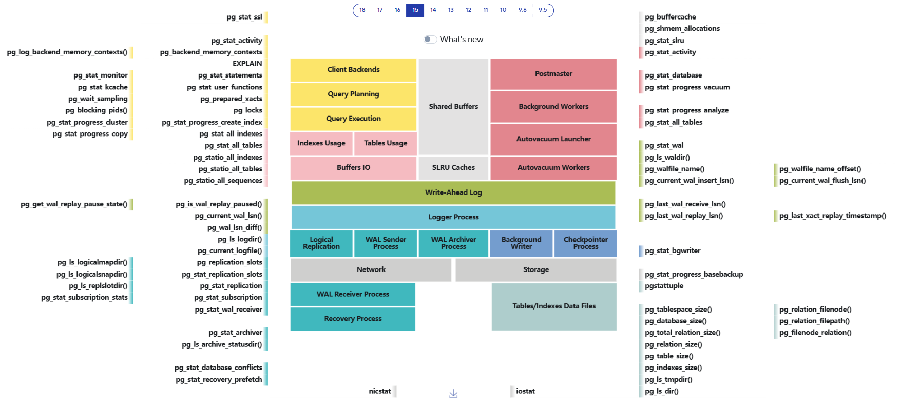

<!--
---
title: "DBA Toolset"
slug: dba-toolset
created: 2026-07-08
updated: 2026-07-08
author: admin
categories: []
tags: []
pinned: true
description: ""
---
-->

# DBA Toolset

## Table of Contents

- [Docs](#docs)
- [Linux](#linux)
  - [Linux Observability Tools](#linux-observability-tools)
  - [CPU](#cpu)
  - [Disk (Block Devices)](#disk-block-devices)
  - [Memory](#memory)
  - [Network](#network)
  - [Debug](#debug)
  - [Processes](#processes)
- [Postgres](#postgres)
  - [Postgres Observability Tools](#postgres-observability-tools)
  - [Online](#online)
  - [Historical](#historical)
  - [Objects and Bloat](#objects-and-bloat)
  - [SQL-tuning](#sql-tuning)
  - [Monitoring](#monitoring)
  - [Backup Restore PITR Dump WAL](#backup-restore-pitr-dump-wal)
  - [Data Corruption](#data-corruption)
  - [Audit and Security](#audit-and-security)
  - [Migrations](#migrations)
  - [High Availability](#high-availability)
  - [Prevention](#prevention)
- [Automation](#automation)

## Docs

 - [Как PostgreSQL может сделать больно, когда не ожидаешь — Михаил Жилин](https://rutube.ru/video/fedb4d1409f5ff09a39ba130ea874479/?r=plwd)

## Linux

### Linux Observability Tools

[source](https://www.brendangregg.com/linuxperf.html)

### CPU

- [perf](https://www.brendangregg.com/perf.html) + [flamegraph](https://www.brendangregg.com/flamegraphs.html)
- [sar](https://man7.org/linux/man-pages/man1/sar.1.html) + [ksar](https://github.com/vlsi/ksar), [sargraph](https://github.com/sargraph/sargraph.github.io)
- eBPF

### Disk (Block Devices)

- blktrace
- ioprof
- iostat
- iotop
- [sar](https://man7.org/linux/man-pages/man1/sar.1.html) + [ksar](https://github.com/vlsi/ksar), [sargraph](https://github.com/sargraph/sargraph.github.io)
- eBPF
- lvm
- parted
- multipath

### Memory

- [perf](https://www.brendangregg.com/perf.html)
- vmstat
- pmap
- Valgrind
- [sar](https://man7.org/linux/man-pages/man1/sar.1.html) + [ksar](https://github.com/vlsi/ksar), [sargraph](https://github.com/sargraph/sargraph.github.io)
- eBPF

### Network

- tcpdump
- wireshark
- [sar](https://man7.org/linux/man-pages/man1/sar.1.html) + [ksar](https://github.com/vlsi/ksar), [sargraph](https://github.com/sargraph/sargraph.github.io)
- eBPF

### Debug

- core-dumps ([one](https://support.postgrespro.ru/note/36), [two](https://www.pgcon.org/2014/schedule/attachments/321_pgcon2014-coredump.pdf))
- gdb
- strace
- DTrace

### Processes

- strace
- pidstat
- vmstat
- gdb
- awk / grep / sed

## Postgres

### Postgres Observability Tools

[source](https://pgstats.ru/?version=15)

### Online

- pg_stat_activity
- ASH-Viewer / PASH-Viewer
- pg_query_state (*patch required)
- custom scripts ([psql-dba-tools](https://github.com/bazaruzero/psql-dba-tools))

### Historical

- pg_stat_statements ++ pg_stat_kcache ++ pg_buffercache ++ pg_profile
- auto_explain
- [query_stat](https://github.com/dataegret/pg-utils/tree/master/sql/global_reports)
- custom scripts for pg_stat_activity sampling (hist_pgsa)
- custom scripts for pg_locks sampling (hist_pgl)
- pg_wait_sampling
- pgsentinel
- pgpro_stats (*PostgresPro only)
- pgpro_pwr (*PostgresPro only)
- performance insights (Platform V Pangolin only)

### Objects and Bloat

- pg_buffercache
- pgstattuple
- pageinspect
- pg_visibility
- pg_freespacemap
- pgrowlocks
- pg_index_watch
- pgRepack / pg_squeeze / pgcompacttable
- custom bloat check scripts ([pgx_scripts](https://github.com/pgexperts/pgx_scripts/tree/master/bloat), [pgsql-bloat-estimation](https://github.com/ioguix/pgsql-bloat-estimation))
- custom scripts for table level autovacuum settings tuning

### SQL-tuning

- explain / exaplain analyze / [explain prettier](https://habr.com/ru/companies/tantor/articles/1019340/)
- pg_hint_plan
- pg_store_plans
- [pg_dbms_stats](https://github.com/ossc-db/pg_dbms_stats)
- PLprofiler
- *AQO, *sr_plan (*PostgresPro only)
- pg_outline (Platform V Pangolin only)

### Monitoring

- [netdata](https://github.com/netdata/netdata)
- zabbix-agent
- postgres-exporter
- pgwatch
- mamonsu
- Zabbix / Prometheus / VictoriaMetrics
- Grafana
- ELK
- Kintsugi  (Platform V Pangolin only)

### Backup Restore PITR Dump WAL

- pg_filedump
- pg_waldump
- pg_walinspect
- pg_dump
- pg_dumpall
- pg_basebackup
- pgBackRest
- walg
- pg_probackup
- barman

### Data Corruption

- amcheck
- pg_dirtyread
- [PDU](https://github.com/wublabdubdub/PDU-PostgreSQLDataUnloader)
- pg_resetwal
- [dirty_hands](https://github.com/dsarafan/pg_dirty_hands)

### Audit and Security

TODO

### Migrations

TODO

### High Availability

TODO

### Prevention

- pg_index_watch

## Automation

- Ansible + AWX
- Jenkins
- Terraform
- ArgoCD
- Docker
- K8s
- Python / Golang

---

<strong>DISCLAIMER</strong>

The information presented here is intended for informational purposes only.
The author assumes no responsibility or liability for any damages resulting
from the application of the techniques described herein. Use this content at
your own risk.
  
Always create backups and test configurations thoroughly before implementing
them in live environments.

